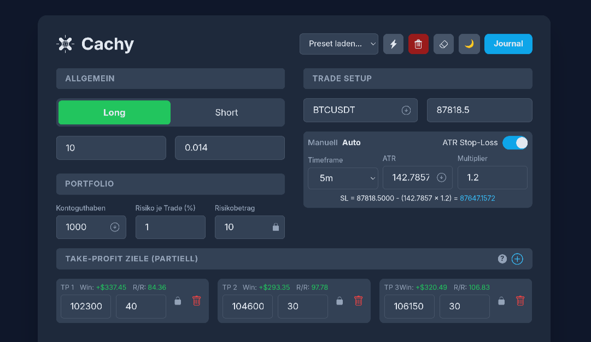

# Cachy - Position Size & Risk Management


[](https://kit.svelte.dev/)
[](https://svelte.dev/)
[](https://tailwindcss.com/)
[](https://www.typescriptlang.org/)
[](https://deepwiki.com/mydcc/cachy-app)
[](LICENSE)

Cachy is a comprehensive web application for crypto traders designed to precisely calculate position sizes, manage risk, and maintain a trading journal. It is entirely local (client-side), privacy-focused, and supports real-time market data from Bitunix and Binance.
Cachy is a comprehensive web application for crypto traders designed to precisely calculate position sizes, manage risk, and maintain a trading journal. It follows a strict **Local-First** architecture (LocalStorage), is privacy-focused, and supports real-time market data from Bitunix and Binance.



---

## 🚀 Features

### 🔢 Smart Trading Calculator

- **Risk Management:** Automatically calculates the optimal position size based on account size, risk (%), and stop loss.
- **Dual Locking System:** Lock either the _Position Size_ (to adjust risk) or the _Risk Amount_ (to adjust position size).
- **ATR Integration:** Automatic fetching of Average True Range (ATR) from Binance or Bitunix for dynamic stop-loss calculations.
- **Live Prices:** Real-time price fetching for cryptocurrencies.

### 📊 Market Overview & Sidebar

- **Real-time Data:** Integration of Bitunix Websockets for ultra-fast updates.
- **Market Overview:** Real-time 24h statistics (Price, Change %, Volume, High, Low) for the selected symbol.
- **Favorites System:** Save up to 4 favorite symbols for quick access. Favorites are displayed in the sidebar (desktop) or below the main card (mobile).
- **Auto-Updates:** Configurable update intervals (1s, 1m, 10m) for market data.

### 🎯 Multi-Target Take Profit

- **Partial Exits:** Define up to 5 take-profit targets.
- **Auto-Balancing:** Percentage distribution automatically adjusts to always total 100%.
- **Detailed Metrics:** Calculates profit, R/R (Risk/Reward), and net return per target and in total.

### 📓 Integrated Journal, Notes & Presets

- **Trade Journal:** Save your trades locally, track status (Open, Won, Lost), and notes.
- **Chat / Side Panel:** A collapsible side panel for "Private Notes" (local) or "Global Chat" (ephemeral server cache).
- **Side Panel:** A collapsible side panel for "Private Notes" (local) and AI Assistant.
- **CSV Import/Export:** Full control over your data – export your journal for Excel or import backups.
- **Presets:** Save frequently used setups (e.g., "Scalping Strategy") for quick access.

### ⚙️ Customization & Tech

- **Multi-API Support:** Choose between **Bitunix** (Default) and **Binance** as your data source.
- **Websocket Integration:** Real-time data feeds for price, order book, and ticker updates (Bitunix).
- **API Integration:** Optional API keys for auto-fetching account balance and private data.
- **Privacy:** All data (journal, settings, API keys) is stored only in your browser's `localStorage`.
- **Backup & Restore:** Easily backup all your settings, presets, and journal entries to a JSON file and restore them anytime.
- **Themes:** Over 20 color themes (Dark, Light, Dracula, Nord, etc.).
- **Multilingual:** German and English support.

### 🧩 Advanced Features

- **Technicals Panel:** Eigenständiges Panel zur Anzeige technischer Indikatoren (z.B. RSI, MACD, Stoch) für das aktuell gewählte Symbol.
- **Global Subscription Management:** Zentrale Verwaltung aller WebSocket-Verbindungen für stabile und effiziente Datenströme.
- **Reference Counting:** Intelligentes Nachverfolgen von Datenanfragen, um Verbindungsabbrüche zu vermeiden.
- **Debug Mode:** Optional aktivierbare System-Logs für bessere Diagnose.
- **Symbol Normalization:** Verbesserte Handhabung von Symbol-Suffixen für stabile API-Zuordnung.
- **Mobile Optimierung:** Verbesserte mobile Ansicht, Sidebar/Market Overview umschaltbar.
- **Sicherheit:** Alle Daten bleiben lokal im Browser (localStorage), keine Cloud/Server-Persistenz.
- **Trading Academy:** Interactive learning modules for candlestick patterns and trading strategies.
- **Technicals Panel:** Standalone panel for technical indicators (RSI, MACD, Stoch) for the active symbol.
- **Global Subscription Management:** Centralized WebSocket management for stable and efficient data streams.
- **Reference Counting:** Smart tracking of data requests to prevent connection drops.
- **Debug Mode:** Optional system logs for better diagnostics.
- **Symbol Normalization:** Improved handling of symbol suffixes for stable API mapping.
- **Mobile Optimization:** Enhanced mobile layout with toggleable Sidebar/Market Overview.
- **Security:** All data remains local (localStorage), no cloud/server persistence.

---

## 🛠️ Installation & Development

### Prerequisites

- Node.js (v18+)
- npm

### Setup

1. **Clone Repository:**

   ```bash
   git clone https://github.com/mydcc/cachy-app.git
   cd cachy-app
   ```

2. **Install Dependencies:**

   ```bash
   npm install
   ```

3. **Start Development Server:**

   ```bash
   npm run dev
   ```

   The app is now running at `http://localhost:5173`.

### Tests

- **Unit Tests (Vitest):**

  ```bash
  npm test
  ```

- **Linting:**

  ```bash
  npm run lint
  ```

---

## 📦 Deployment

The app is a SvelteKit application and can be deployed as a Node.js server or a static site (with the appropriate adapter).

**Production Build:**

```bash
npm run build
```

**Start (Node.js):**

```bash
npm start
# or with PM2
pm2 start build/index.js --name "cachy-app"
```

See `DEPLOYMENT.md` for detailed instructions.

---

## 📚 Documentation

- **User Guide:** A detailed guide on how to use the app can be found directly within the application (via the "Guide" button) or in `src/instructions/guide.en.md`.
- **Developer Guidelines:** Refer to `AGENT.md` for coding conventions and processes.
- **Changelog:** Changes are automatically documented in `src/instructions/changelog.en.md`.

---

## 🤝 Contributing

Contributions are welcome! Please follow these steps:

1. Use [Conventional Commits](https://www.conventionalcommits.org/) for your commit messages (important for automated versioning).
2. Create a separate branch for each feature (`feat/my-feature`).
3. Ensure that `npm test` and `npm run lint` pass successfully.

---

## 📄 License

This project is published under the [GNU Affero General Public License v3.0 (AGPLv3)](LICENSE).

Copyright (C) 2026 MYDCT

---

## Changelog

### Table of Contents

1. [Version 0.94.2](#v0.94.2)
2. [Version 0.94b2](#v0.94b2)
3. [Version 0.94b1](#v0.94b1)
4. [Version 0.94](#v0.94)
5. [Version 0.92b2](#v0.92b2)
6. [Version 0.92b1](#v0.92b1)
7. [Version 0.92b](#v0.92b)

---

## <a name="v0.94.3"></a>Version 0.94.3 (February 2026)

- **Architecture:** **Local-First Only**: Removed "Global Chat" and "Community Cloud".
- **New:** **Trading Academy**: Interactive learning modules.
- **Tech:** **Svelte 5 Migration**: Complete refactor to Runes.
- **RSS Feed Integration**: Custom RSS feeds for AI context.

---

## <a name="v0.94.2"></a>Version 0.94.2 (January 2026)

- **Architecture:** **Global Subscription Management**: Centralized WebSocket management with the `MarketWatcher` service.
- **System:** **Reference Counting**: Smart data request tracking to prevent connection drops.
- **Robustness:** **Symbol Normalization**: Improved handling of symbol suffixes for stable API mapping.

- **Feature:** **Technicals Panel**: Advanced chart overlay with indicators (RSI, MACD, Stoch) using `talib-web`.
- **New:** **Debug Mode**: Opt-in system logs for better diagnostics.

---

## <a name="v0.94b2"></a>Version 0.94b2 (February 2026)

- **New:** "Show Sidebars" setting: Toggle visibility of the sidebar (favorites) and Market Overview to save screen space on desktop and mobile.
- **Improvement:** Enhanced mobile layout with integrated positions view.
- **Fix:** Fixed Bitunix "Pending Positions" calculation issues (handling of 'side' parameter).
- **System:** Improved internal data structure for settings and API keys.

---

## <a name="v0.94b1"></a>Version 0.94b1 (January 2026)

- **New:** Backup & Restore feature: Create backups of your data (settings, journal, presets) and restore them when needed.
- **Improvement:** Risk per Trade input now supports up to 2 decimal places.
- **Improvement:** General stability improvements.

---

## <a name="v0.94"></a>Version 0.94 (December 21, 2025)

- **New:** Favorites feature: Save up to 4 symbols by clicking the star icon in the Market Overview. Favorites are displayed in the sidebar (desktop) or below the main card (mobile).
- **New:** Auto-fetch account balance on startup (enable in settings, requires API keys).
- **New:** Auto-update price input field (optional).
- **Fix:** Fixed deployment issues (502 errors) and improved stability.

---

## <a name="v0.92b2"></a>Version 0.92b2 (December 11, 2025)

- **New:** "Market Overview" displays 24h data (Price, Volume, Change) for the current symbol.
- **New:** Expanded settings: Select API provider (Bitunix/Binance) and market data update interval (1s, 1m, 10m).

---

## <a name="v0.92b1"></a>Version 0.92b1 (September 04, 2025)

- **New:** Automatic ATR fetch from Binance API with selectable timeframe (5m, 15m, 1h, 4h, 1d). The fetched value can be manually adjusted.
- **New:** Advanced locking functions: The risk amount in currency can now be locked to calculate position size and risk percentage.
- **New:** Keyboard shortcuts (`Alt+L/S/R/J`) added for faster operation.
- **New:** Modals can now be closed with the `Escape` key or by clicking the background.

---

## <a name="v0.92b"></a>Version 0.92b (August 22, 2025)

- **Improvement:** Symbol input field now accepts letters and numbers.
- **Fixed:** Tooltip border is now theme-dependent and the double border issue has been fixed.
- **Improvement:** "Add Trade to Journal" and "Show Instructions" buttons are now theme-dependent.
