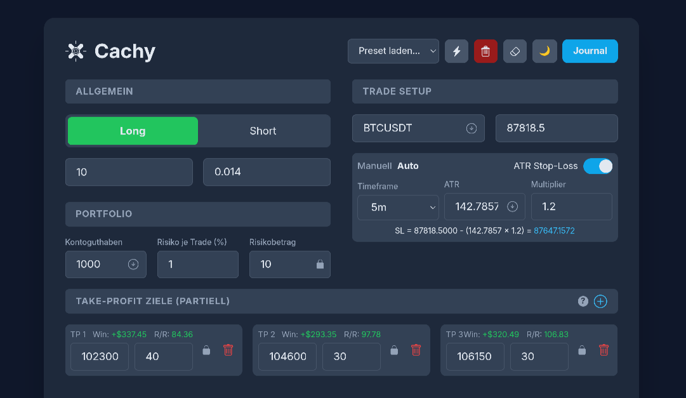

# Cachy - Position Size & Risk Management

[](https://github.com/mydcc/cachy-app/releases)
[](https://kit.svelte.dev/)
[](https://svelte.dev/)
[](https://tailwindcss.com/)
[](https://www.typescriptlang.org/)
[](LICENSE)

Cachy is a comprehensive web application for crypto traders designed to precisely calculate position sizes, manage risk, and maintain a trading journal. It follows a strict **Local-First** architecture (LocalStorage), is privacy-focused, and supports real-time market data from Bitunix and Bitget.



---

## 🚀 Features

### 🔢 Smart Trading Calculator

- **Risk Management:** Automatically calculates the optimal position size based on account size, risk (%), and stop loss.
- **Dual Locking System:** Lock either the _Position Size_ (to adjust risk) or the _Risk Amount_ (to adjust position size).
- **ATR Integration:** Automatic fetching of Average True Range (ATR) from Bitget or Bitunix for dynamic stop-loss calculations.
- **Live Prices:** Real-time price fetching for cryptocurrencies.

### 📊 Market Overview & Sidebar

- **Real-time Data:** Integration of Bitunix Websockets for ultra-fast updates.
- **Market Overview:** Real-time 24h statistics (Price, Change %, Volume, High, Low) for the selected symbol.
- **Favorites System:** Save up to 4 favorite symbols for quick access. Favorites are displayed in the sidebar (desktop) or below the main card (mobile).
- **Auto-Updates:** Configurable update intervals (1s, 1m, 10m) for market data.

### 🎯 Multi-Target Take Profit

- **Partial Exits:** Define up to 5 take-profit targets.
- **Auto-Balancing:** Percentage distribution automatically adjusts to always total 100%.
- **Detailed Metrics:** Calculates profit, R/R (Risk/Reward), and net return per target and in total.

### 📓 Integrated Journal, Notes & Presets

- **Trade Journal:** Save your trades locally, track status (Open, Won, Lost), and notes.
- **Side Panel:** A collapsible side panel for "Private Notes" (local) and the AI Assistant.
- **CSV Import/Export:** Full control over your data – export your journal for Excel or import backups.
- **Presets:** Save frequently used setups (e.g., "Scalping Strategy") for quick access.

### ⚙️ Customization & Tech

- **Multi-API Support:** Choose between **Bitunix** (Default) and **Bitget** as your data source.
- **Websocket Integration:** Real-time data feeds for price, order book, and ticker updates (Bitunix).
- **API Integration:** Optional API keys for auto-fetching account balance and private data.
- **Privacy:** Your journal, settings, API keys, presets and notes are stored only in your browser's `localStorage` and are never sent to a Cachy server. The one optional exception is Global Chat message content — off by default, requires an explicit token, and every core function works without it. See [ADR-0001](docs/adr/0001-local-first-boundary.md).
- **Backup & Restore:** Easily backup all your settings, presets, and journal entries to a JSON file and restore them anytime.
- **Themes:** Over 20 color themes (Dark, Light, Dracula, Nord, etc.).
- **Multilingual:** German and English support.

### 🧩 Advanced Features

- **Trading Academy:** Interactive learning modules for candlestick patterns and trading strategies.
- **Technicals Panel:** Standalone panel for technical indicators (RSI, MACD, Stoch) for the active symbol.
- **Global Subscription Management:** Centralized WebSocket management for stable and efficient data streams.
- **Reference Counting:** Smart tracking of data requests to prevent connection drops.
- **Debug Mode:** Optional system logs for better diagnostics.
- **Symbol Normalization:** Improved handling of symbol suffixes for stable API mapping.
- **Mobile Optimization:** Enhanced mobile layout with toggleable Sidebar/Market Overview.
- **Security:** Trading data and credentials remain local (`localStorage`). The only server-side data is optional Global Chat message content — see the Privacy note above.
- **Global Chat (optional):** An opt-in chat backed by SpacetimeDB, reachable from the Cloud settings tab. Disabled by default and never carries journal, settings or key data.

---

## 🛠️ Installation & Development

### Prerequisites

- Node.js **v20 or newer** (see `engines` in `package.json`; `.node-version` pins 20.18.3 for tooling)
- npm
- _Optional:_ a Rust toolchain with the `wasm32-unknown-unknown` target. `npm run dev` and `npm run build` invoke `scripts/build_wasm.sh` to rebuild the `technicals-wasm` indicator module. Without Rust the script skips the build and the pre-compiled binary committed in `static/wasm/` is used, so a plain `npm install && npm run dev` works out of the box.

### Setup

1. **Clone Repository:**

   ```bash
   git clone https://github.com/mydcc/cachy-app.git
   cd cachy-app
   ```

2. **Install Dependencies:**

   ```bash
   npm install
   ```

3. **Configure the environment:**

   ```bash
   cp .env.example .env
   openssl rand -hex 32   # paste the result as APP_ACCESS_TOKEN in .env
   ```

   `APP_ACCESS_TOKEN` is **required**. Authentication fails closed: without it, all 17 guarded API routes answer 401 and the app cannot reach its own backend. Put the same value into the running app under **Settings → Connections → App Access Token** so the browser sends it. See [ADR-0002](docs/adr/0002-api-authentication-fails-closed.md).

   > ⚠️ **Deploying this to an existing instance:** set `APP_ACCESS_TOKEN` on the server **before** deploying, or every API call on the live site starts failing with 401.

   > ⚠️ **Never put a secret behind a `VITE_`-prefixed variable.** Vite inlines any such variable into the client bundle, so its value is served as plain JavaScript to every visitor. AI keys are entered per user in Settings → AI and stay in that browser.

4. **Start Development Server:**

   ```bash
   npm run dev
   ```

   The app is now running at `http://localhost:5173`.

### Tests

- **Unit Tests (Vitest):**

  ```bash
  npm test
  ```

  A required CI check, and the whole suite must be green.

- **Performance benchmarks:**

  ```bash
  npm run test:perf
  ```

  Excluded from `npm test` and run in a **non-blocking** CI job. They assert
  wall-clock time and heap growth, which on a shared runner is dominated by noise
  — the scaling check compares a ~5ms measurement against a ~24ms one, so a GC
  pause moves the result more than a real regression would. Treat a red run as a
  hint to investigate, not as a gate.

- **Type check:**

  ```bash
  npm run check
  ```

- **Linting:**

  ```bash
  npm run lint
  ```

  > **Lint is a required CI check.** The error count is **0 and must stay 0** — any error fails the build.
  >
  > Warnings are capped by a **ratchet**: CI runs `eslint . --max-warnings 74`, the size of the pre-existing `no-explicit-any` / `no-unused-vars` backlog. That number may only ever be *lowered*, never raised, so the backlog can shrink but cannot grow. When you fix warnings, lower the ceiling in `.github/workflows/audit.yml` to match. See `docs/ROADMAP.md` item 21.
  >
  > If a rule fires on something deliberate, do not silence it globally: add an inline `eslint-disable-next-line` with a `--` explanation, as done for the Svelte 5 dependency-registration reads in `tradeCalculator.svelte.ts`.

---

## 📦 Deployment

The app is a SvelteKit application and can be deployed as a Node.js server or a static site (with the appropriate adapter).

**Production Build:**

```bash
npm run build
```

**Start (Node.js):**

```bash
npm start
# or with PM2
pm2 start build/index.js --name "cachy-app"
```

See `DEPLOYMENT.md` for detailed instructions.

---

## 📚 Documentation

- **User Guide:** A detailed guide on how to use the app can be found directly within the application (via the "Guide" button) or in `src/lib/assets/content/guide.en.md`.
- **Technical Whitepaper:** `src/lib/assets/content/whitepaper.en.md` — architecture, the mathematical core, and the security model.
- **Developer Guidelines:** `CLAUDE.md` for the non-negotiable coding rules (Svelte 5 Runes, `decimal.js`, theming), `AGENT.md` for the development process.
- **Open decisions:** [`docs/TODO.md`](docs/TODO.md) — items waiting on a person rather than on a plan.
- **Scripts:** [`scripts/README.md`](scripts/README.md) — what each of the ~20 scripts does, and which ones run automatically.
- **Global Chat:** [`docs/GLOBAL-CHAT.md`](docs/GLOBAL-CHAT.md) — the only Class B feature: what is stored, how tokens are issued, the retention policy, and why nothing else breaks when the server is down.
- **Brand & Design:** [`docs/BRAND.md`](docs/BRAND.md) — the colour palette, the theme system and the rule against hardcoded colours. Written from `src/themes.css`, which stays the source of truth.
- **Changelog:** [`CHANGELOG.md`](CHANGELOG.md), generated by semantic-release from 1.0.0 onward. The hand-written 0.9x history is archived in [`docs/CHANGELOG-legacy.md`](docs/CHANGELOG-legacy.md).

---

## 🤝 Contributing

Contributions are welcome! Please follow these steps:

1. Use [Conventional Commits](https://www.conventionalcommits.org/) for your commit messages — the release version is derived from them (see Versioning below). CI rejects pull requests whose commits do not conform.
2. Create a separate branch for each feature (`feat/my-feature`).
3. Ensure that `npm run check`, `npm test` and `npm run lint` pass. All three are required CI checks: type checking and lint must report zero errors, and the full test suite must be green.

---

## 🔖 Versioning

Cachy uses [semantic-release](https://semantic-release.gitbook.io/). Version numbers are **never edited by hand** — the commit messages determine the next release:

| Commit prefix                  | Release | Example             |
| ------------------------------ | ------- | ------------------- |
| `fix:` / `perf:`               | Patch   | `1.0.0` → `1.0.1`   |
| `feat:`                        | Minor   | `1.0.0` → `1.1.0`   |
| `BREAKING CHANGE:` in footer   | Major   | `1.0.0` → `2.0.0`   |
| `chore:` `docs:` `refactor:` … | none    | no release          |

### Branches

Two release channels, matching the split `deploy.sh` already uses via `.deploy.conf`:

| Branch    | Channel            | Deploys to     | Example version  |
| --------- | ------------------ | -------------- | ---------------- |
| `main`    | stable             | cachy.app      | `1.0.0`          |
| `develop` | `beta` prerelease  | dev.cachy.app  | `1.0.0-beta.1`   |

Feature branches target `develop`. On every push, the Release workflow bumps `version` in `package.json`, prepends the release notes to `CHANGELOG.md`, creates the Git tag and publishes a GitHub release. A stable release happens when `develop` merges into `main`.

The app reads its version from exactly one place: the `version` field in `package.json`. `vite.config.ts` injects it as `VITE_APP_VERSION`, and `src/lib/version.ts` exposes it as `APP_VERSION`. **Do not hardcode version strings anywhere else** — if you see `0.0.0-unknown` in the UI, the build did not pick up the injected value.

---

## 📄 License

This project is published under the [GNU Affero General Public License v3.0 (AGPLv3)](LICENSE).

Copyright (C) 2026 MYDCT

---

## 📜 Changelog

Versioning restarts at **1.0.0** with the move to automated releases. From there on the changelog is generated from Conventional Commits:

- [`CHANGELOG.md`](CHANGELOG.md) — current, generated by semantic-release
- [`docs/CHANGELOG-legacy.md`](docs/CHANGELOG-legacy.md) — hand-written history of the 0.9x releases that preceded 1.0.0
- [GitHub Releases](https://github.com/mydcc/cachy-app/releases) — release notes per tag

---

[](https://deepwiki.com/mydcc/cachy-app)
