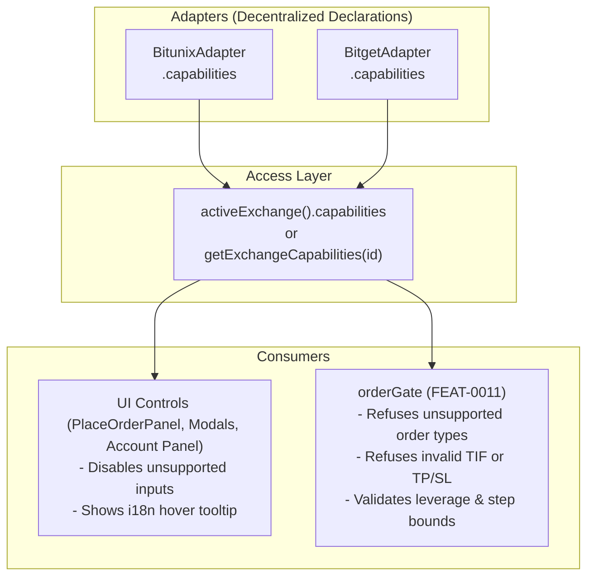

# FEAT-0017 — Describe what each exchange can do, and let the UI read it

## Problem

Exchanges genuinely differ: hedge mode, multi-asset margin, trailing stops,
fixed-risk orders and conditional order types are not universal, and neither are
their parameter ranges. Without a capability model the UI either assumes the
lowest common denominator — losing features on the exchange that has them — or
assumes the richest and fails at submission, which is the worse failure because
it happens after the user committed.

## Proposal

Each adapter declares its capabilities: supported order types, margin modes,
position modes, asset modes, TP/SL attachment, trailing support, leverage
bounds, quantity and price step sizes.

The UI reads capabilities and hides or disables what the active exchange cannot
do, with a reason on hover rather than a silent absence. The
[`FEAT-0011`](FEAT-0011-preflight-order-verification.md) gate reads the same
declarations, so an unsupported combination is refused before transport even if
the UI is wrong.

## Implementation Plan

### 1. Architecture & Data Flow

### 2. Proposed Changes by Component

#### `src/services/exchange/types.ts` & `src/services/exchangeCapabilities.ts`
- Transition `src/services/exchangeCapabilities.ts` from a static seam table to a delegation layer querying registered adapters.
- Define comprehensive capability interfaces on `ExchangeCapabilities`:
  - `orderTypes: readonly OrderEntryType[]` (`market`, `limit`, `trigger`)
  - `timeInForce: readonly TimeInForce[]` (`GTC`, `IOC`, `FOK`, `POST_ONLY`)
  - `tpSlAtEntry: boolean`
  - `multipleTakeProfits: boolean`
  - `marginModes: readonly ("cross" | "isolated")[]`
  - `positionModes: readonly ("one_way" | "hedge")[]`
  - `trailingStop: boolean`
  - Helper functions `capabilitiesOf(exchangeId)` and `unsupportedReasonKey(exchange, type)`.

#### `src/services/exchange/bitunixAdapter.ts` & `bitgetAdapter.ts`
- Bitunix adapter declares full capabilities matching verified endpoints (`orderTypes: ["market", "limit"]`, `tpSlAtEntry: true`, `timeInForce: ["GTC", "IOC", "FOK", "POST_ONLY"]`, `marginModes: ["cross", "isolated"]`, etc.).
- Bitget adapter declares conservative capabilities matching verified wire formats (`orderTypes: ["market", "limit"]`, `tpSlAtEntry: false`, `timeInForce: []`, etc.).
- Isolates adapter declarations: modifying capabilities of one venue cannot affect another.

#### `src/services/orderGate.ts` (Verification Gate)
- Extend pre-flight checks to cross-reference order options (order type, time in force, entry TP/SL attachments, leverage) against target exchange capabilities.
- Issue `RefusalReason: "unsupported"` when an order requires unsupported capabilities, acting as the independent non-UI safety boundary.

#### UI Controls & i18n (`PlaceOrderPanel.svelte`, `locales/`)
- Consume `activeExchange().capabilities` dynamically.
- Render unsupported options disabled with clear hover tooltips translated via `unsupportedReasonKey` in both German (`de.json`) and English (`en.json`).

---

## Acceptance criteria

- [ ] Capabilities are declared per adapter and consumed by the UI
- [ ] A control for an unsupported capability is not reachable, tested per
      exchange
- [ ] The verification gate refuses an unsupported combination independently of
      the UI
- [ ] Step sizes and leverage bounds come from capabilities, not constants
- [ ] Adding a capability to one adapter changes no other adapter

## Verification Strategy

- `npm run check` (svelte-check)
- `npm test` across unit and component test suites:
  - `src/services/exchange/exchangeAdapter.test.ts`
  - `src/services/exchange/unsupportedVerbs.test.ts`
  - `src/services/orderGate.test.ts`
  - `src/components/results/PlaceOrderPanel.component.test.ts`
- `scripts/check_translations.sh` (0 missing, 0 empty, 0 one-sided keys)

## Links

- [`FEAT-0016`](FEAT-0016-exchange-adapter-interface.md)
- [`FEAT-0229`](FEAT-0229-refuse-unsupported-verbs-locally.md)
- [`FEAT-0020`](FEAT-0020-account-settings-panel.md) — the main consumer
