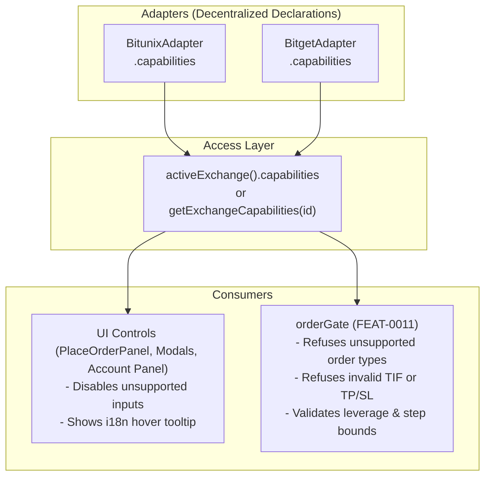

# FEAT-0017 — Describe what each exchange can do, and let the UI read it

## Problem

Exchanges genuinely differ: hedge mode, multi-asset margin, trailing stops,
fixed-risk orders and conditional order types are not universal, and neither are
their parameter ranges. Without a capability model the UI either assumes the
lowest common denominator — losing features on the exchange that has them — or
assumes the richest and fails at submission, which is the worse failure because
it happens after the user committed.

## Proposal

Each adapter declares its capabilities: supported order types, margin modes,
position modes, asset modes, TP/SL attachment, trailing support, leverage
bounds, quantity and price step sizes.

The UI reads capabilities and hides or disables what the active exchange cannot
do, with a reason on hover rather than a silent absence. The
[`FEAT-0011`](FEAT-0011-preflight-order-verification.md) gate reads the same
declarations, so an unsupported combination is refused before transport even if
the UI is wrong.

## Implementation Plan

### 1. Architecture & Data Flow

### 2. Proposed Changes by Component

#### `src/services/exchange/types.ts` & `src/services/exchangeCapabilities.ts`
- Transition `src/services/exchangeCapabilities.ts` from a static seam table to a delegation layer querying registered adapters.
- Define comprehensive capability interfaces on `ExchangeCapabilities`:
  - `orderTypes: readonly OrderEntryType[]` (`market`, `limit`, `trigger`)
  - `timeInForce: readonly TimeInForce[]` (`GTC`, `IOC`, `FOK`, `POST_ONLY`)
  - `tpSlAtEntry: boolean`
  - `multipleTakeProfits: boolean`
  - `marginModes: readonly ("cross" | "isolated")[]`
  - `positionModes: readonly ("one_way" | "hedge")[]`
  - `trailingStop: boolean`
  - Helper functions `capabilitiesOf(exchangeId)` and `unsupportedReasonKey(exchange, type)`.

#### `src/services/exchange/bitunixAdapter.ts` & `bitgetAdapter.ts`
- Bitunix adapter declares full capabilities matching verified endpoints (`orderTypes: ["market", "limit"]`, `tpSlAtEntry: true`, `timeInForce: ["GTC", "IOC", "FOK", "POST_ONLY"]`, `marginModes: ["cross", "isolated"]`, etc.).
- Bitget adapter declares conservative capabilities matching verified wire formats (`orderTypes: ["market", "limit"]`, `tpSlAtEntry: false`, `timeInForce: []`, etc.).
- Isolates adapter declarations: modifying capabilities of one venue cannot affect another.

#### `src/services/orderGate.ts` (Verification Gate)
- Extend pre-flight checks to cross-reference order options (order type, time in force, entry TP/SL attachments, leverage) against target exchange capabilities.
- Issue `RefusalReason: "unsupported"` when an order requires unsupported capabilities, acting as the independent non-UI safety boundary.

#### UI Controls & i18n (`PlaceOrderPanel.svelte`, `locales/`)
- Consume `activeExchange().capabilities` dynamically.
- Render unsupported options disabled with clear hover tooltips translated via `unsupportedReasonKey` in both German (`de.json`) and English (`en.json`).

---

## Acceptance criteria

- [x] Capabilities are declared per adapter and consumed by the UI
      → each venue owns `exchange/<venue>Capabilities.ts`; the adapter reads
      its own for `adapter.capabilities`, and `PlaceOrderPanel` reads the same
      declarations through `capabilitiesOf`.
- [x] A control for an unsupported capability is not reachable, tested per
      exchange
      → `PlaceOrderPanel.capabilities.component.test.ts`, 14 tests, every case
      run against both venues. Unsupported controls are rendered **disabled
      with a reason**, not omitted — a vanished control reads as a feature
      Cachy lacks.
- [x] The verification gate refuses an unsupported combination independently of
      the UI
      → `orderGate.capabilities.test.ts`, 18 tests. The gate looks capabilities
      up itself rather than accepting them from `displayed`; taking them from
      the UI would make the check agree with the bug it exists to catch.
- [x] Step sizes and leverage bounds come from capabilities, not constants
      → already true when this item was picked up, and satisfied more strictly
      than written: they are **per-symbol** metadata (`market.symbolMeta`, set
      by `fetchTradingPairInfo`), not exchange-wide. An exchange-level bound
      would be wrong for most contracts — 125× is right for BTCUSDT and wrong
      for most altcoin perpetuals — so no capability field was added for them.
- [x] Adding a capability to one adapter changes no other adapter
      → `exchangeCapabilities.test.ts` pins it: separate declaration objects,
      no shared array instances, and every declaration frozen.

## Deviations from the plan above

Three, each with a reason:

1. **Declarations are leaf data modules, not registry delegation.** The plan
   had `exchangeCapabilities.ts` query registered adapters. `orderGate` is a
   consumer, and it imports nothing but `decimal.js` on purpose — its docstring
   promises no network and no store reads. Going through the registry would
   have put `apiService`, both WebSocket services, `tradeService` and
   `settingsState` in the safety gate's import graph. The declarations are
   import-free data instead, read by both the adapter and the aggregator, so
   the two paths agree by construction (asserted).

2. **`trailingStop` is `false` on both venues.** The plan lists trailing
   support as a capability. Cachy has no trailing-stop wire format anywhere —
   the only "trailing" in the codebase is the ATR trailing-stop *indicator*,
   which draws a line and places nothing. Declaring the venue's capability
   rather than Cachy's would produce a control whose submission fails after the
   trader commits.

3. **`positionModes` is empty for Bitget.** No Bitget response Cachy reads
   carries a position mode, so there is nothing to declare. Bitunix declares
   both, which `mappers.ts` and `buildCloseOrderFields` evidence.

## Raised in review (PR #2271), and fixed

- **`tradeService` re-introduced the GTC it was handed `undefined` for.**
  `placeOrder` applied `params.effect ?? "GTC"` before asking whether the venue
  has a time in force at all. `orderPlacementService` resolved `undefined` for
  a venue declaring none, exactly as intended, and the default put the value
  straight back — so every Bitget limit entry reached the gate carrying
  `effect: "GTC"` and was refused over a field the trader never touched and the
  panel showed as "—".

  Not repaired by deleting the default: FEAT-0069 specified it, and Bitunix
  documents `effect` as **required** on a limit order, so removing it outright
  would break the venue that works. `effectFor()` applies it only where the
  venue declares a time in force; an explicit value is always honoured,
  including one the venue cannot take — that one travels and is refused by
  name.

  **The test gap that allowed it** is the more useful finding.
  `orderPlacementService.test.ts` mocks `tradeService.placeOrder`, so it only
  ever saw what was passed *in*; `orderGate.capabilities.test.ts` builds
  payloads by hand; and `tradeService_placeOrder.test.ts` pins `apiProvider` to
  `"bitunix"` in a non-mutable mock, so no venue-specific behaviour could
  surface there. Three green suites, none of them running the join.
  `tradeService.timeInForce.test.ts` closes it with a switchable venue and a
  real `placeOrder`; the reproduction was confirmed failing before the repair.

- **The gate could never refuse a trigger.** `entryTypeOf` returned `null` for
  any spelling outside `MARKET`/`LIMIT`, and the caller skipped the capability
  check on `null` — a hole under exactly the verb no venue declares. It now
  reads three outcomes: known (checked), unreadable (**refused** — an order
  type the gate cannot verify is not a verified order type, the same rule the
  symbol check applies), and absent (left to the missing-field rule). Trigger
  spellings map to `trigger` rather than being rejected by name, so a venue
  that later declares one is allowed without touching the function.
- **A silent time-in-force downgrade.** `POST_ONLY` on a venue declaring none
  was dropped without a word: "maker only" became "whatever fills", which is a
  different fill at a different fee. Only `GTC` is dropped now — it is the
  neutral default and changes nothing — while `IOC`/`FOK`/`POST_ONLY` travel
  and the gate refuses them out loud. The panel additionally derives the
  submitted value from `caps` (`$derived`, not an `$effect` reset) so it cannot
  lag a runtime exchange switch by a tick.
- **The ladder check sat inside the attach branch**, so an entry attaching only
  a stop, with targets placed separately, was refused for holding a ladder it
  never claimed. It is keyed on the payload carrying a target now.
- **The audit trail overclaimed.** `checked` recorded `orderTypeSupported` even
  when no comparison happened; it now records only comparisons that ran.
- **Accessibility and copy.** The disabled time-in-force control carries the
  reason as `aria-label` as well as `title` — a disabled select is never
  focusable, so a title reaches a mouse and nothing else. German
  "verfallen" → "verworfen".
- **The panel's fallback could have invented a loaded value.**
  `effectiveTimeInForce` fell back to `caps.timeInForce[0]`, which is GTC on
  both venues today and would be *IOC* on a venue declaring `["IOC", …]` —
  handing an order that cancels whatever does not fill immediately to a trader
  who selected nothing. The fallback is unconditionally GTC now: the only
  neutral value, and the only one `orderPlacementService` may drop. A venue
  that cannot take even GTC is refused by the gate rather than quietly given
  something else.

## Found on the way

- [`BUG-0297`](../bugs/BUG-0297-bitget-entry-order-gate-deadlock.md) — **P1.**
  A `tpSlAtEntry: false` venue cannot produce an accepted entry order at all:
  the size rule needs `displayed.stopLossPrice`, the price rule then demands a
  matching payload `slPrice`, and the capability forbids sending one. Predates
  this item and was not fixed here — it changes money-safety logic and wanted
  its own review. **Fixed since**, under its own item: the price rule now skips
  protection the venue cannot carry, derived from the declaration rather than
  from the caller.
- A prototype-chain hole in `capabilitiesOf`, fixed here because this item
  introduced its most dangerous caller: `CAPABILITIES["constructor"]` returned
  a *function* rather than falling through to `UNKNOWN_EXCHANGE`, and the venue
  id comes from user-writable localStorage. Left alone, the new gate check
  would have thrown while submitting an order.

## Verification Strategy

- `npm run check` (svelte-check)
- `npm test` across unit and component test suites:
  - `src/services/exchangeCapabilities.test.ts` — new, 19 tests
  - `src/services/orderGate.capabilities.test.ts` — new, 26 tests
  - `src/components/results/PlaceOrderPanel.capabilities.component.test.ts`
    — new, 16 tests, each case run against both venues
  - `src/services/orderPlacementService.test.ts` — 6 added, pinning which
    time-in-force may be dropped silently and which may not
  - `src/services/tradeService.timeInForce.test.ts` — new, 6 tests, the only
    suite that runs `placeOrder` for real against a *switchable* venue and so
    the only one that can catch a venue-specific payload defect
  - `src/services/tradeService_placeOrder.test.ts` — unchanged and still green,
    which is the point: FEAT-0069's GTC default survives on the venue that
    declares one
  - `src/services/exchange/exchangeAdapter.test.ts`
  - `src/services/exchange/unsupportedVerbs.test.ts`
  - `src/services/orderGate.test.ts`
  - `src/tests/architecture/exchange_boundary.test.ts`
- `scripts/check_translations.sh` (0 missing, 0 empty, 0 one-sided keys)
- `node scripts/generate-i18n-types.js` after the new keys, without which
  `npm run check` rejects them

## Links

- [`FEAT-0016`](FEAT-0016-exchange-adapter-interface.md)
- [`FEAT-0229`](FEAT-0229-refuse-unsupported-verbs-locally.md)
- [`FEAT-0020`](FEAT-0020-account-settings-panel.md) — the main consumer
