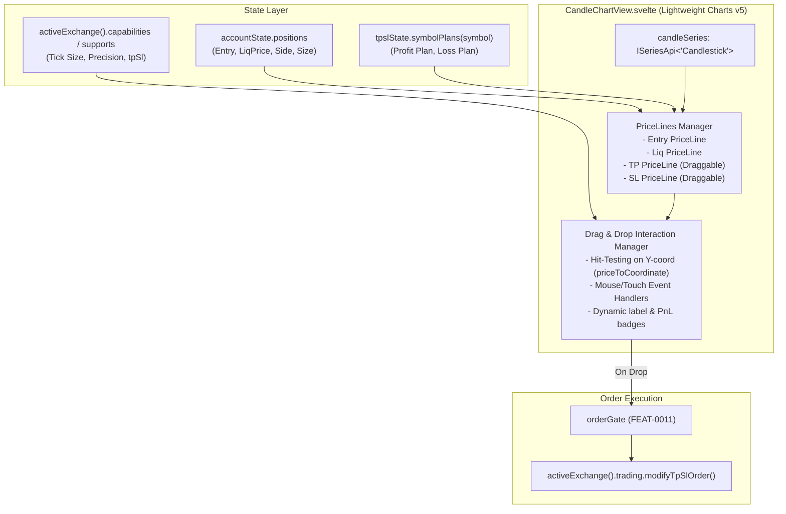

# FEAT-0247 — Interactive chart positions and draggable TP/SL lines

## Problem

Traders monitoring charts in Cachy currently have to switch between the candlestick view and the trade/positions panel or TP/SL modal to see their open positions, entry prices, liquidation thresholds, and resting take-profit/stop-loss levels. Modifying a stop-loss or take-profit requires opening an edit modal and typing numerical values by hand.

TradingView and modern exchange terminals allow traders to see their active positions and resting TP/SL orders directly on the price chart as horizontal price lines, and to drag those lines to adjust TP/SL orders interactively.

## Proposal

Leverage Lightweight Charts v5 APIs (`createPriceLine`, `priceToCoordinate`, `coordinateToPrice`) in `CandleChartView.svelte` to:
1. Render live price lines for the active symbol's open position (Entry, Liquidation) and pending TP/SL orders.
2. Display distance (% and USDT PnL) directly on the line labels.
3. Enable dragging of TP and SL lines: hovering over a line shows a resize cursor, dragging updates the line in real-time with tick-size snapping, and releasing (drop) sends `modifyTpSlOrder` to the exchange.

## Implementation Plan

### 1. Architecture & Data Flow

### 2. Task Breakdown

- **Task 1: Position & TP/SL PriceLines Lifecycle:** Reactively create, update, and clean up `createPriceLine` instances on `candleSeries` when `accountState.positions` or `tpslState.symbolPlans(symbol)` change.
- **Task 2: PnL & Distance Labels:** Dynamic formatted text on lines showing % and USDT PnL (e.g. `TP: $68,500 (+5.38% / +$269.00)`).
- **Task 3: Hit-Testing & Hover States:** Mouse detection within ±6px of draggable TP/SL lines; cursor switches to `ns-resize`.
- **Task 4: Interactive Dragging & Snapping:** Real-time `coordinateToPrice` updates during `mousemove`, snapped to symbol price precision / tick-size.
- **Task 5: Drop & Order Modification:** On `mouseup`, submit `modifyTpSlOrder` via `activeExchange().trading`. Revert line on failure/cancel (Escape key).

## Acceptance criteria

- [ ] Active position Entry, Liquidation, TP, and SL lines render accurately on the candlestick chart for the active symbol.
- [ ] Line labels display price, percentage distance, and projected PnL in USDT.
- [ ] Hovering over TP/SL lines shows a vertical resize cursor and tooltip.
- [ ] Dragging TP/SL lines smoothly updates the visual price line with symbol tick-size snapping.
- [ ] Dropping the line triggers `modifyTpSlOrder`, updating the order on the active exchange.
- [ ] On exchanges where TP/SL modification is unsupported (`supports.tpSl === false`), lines are displayed as read-only.
- [ ] Pressing Escape during drag cancels the operation and restores the original price level.

## Verification Strategy

- `npm run check`
- `npm test` covering:
  - `src/lib/windows/implementations/CandleChartView.component.test.ts`
  - `src/services/chart/priceLineManager.test.ts`
- Manual verification on live/paper test positions.

## Links

- [`FEAT-0017`](FEAT-0017-exchange-capability-model.md)
- [`FEAT-0020`](FEAT-0020-account-settings-panel.md)
- [`FEAT-0070`](FEAT-0070-bitunix-tpsl-placement.md)
