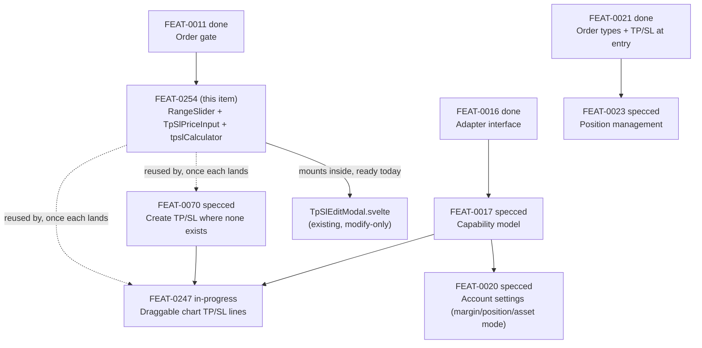

# FEAT-0254 — Give TP/SL price entry a range slider and PnL/ROI/Change modes

## Problem

`TpSlEditModal.svelte` is the only TP/SL input Cachy has today, and it is a
bare number field: type a trigger price, type a quantity, submit. The Bitunix
reference UI ([`IDEA-0199`](../ideas/IDEA-0199-bitunix-ui-analysis.md) §1.2)
offers a 0/25/50/75/100% slider bound to the position's PnL, ROI or raw price
change, with the trigger price computed live as the trader drags — the number
field is there for precision, not as the only way in. Typing a raw price
forces the trader to do the PnL/ROI arithmetic themselves before every edit,
which is exactly the kind of manual step this app exists to remove.

This gap sits underneath three separate backlog items that all need a TP/SL
input at some point — [`FEAT-0070`](FEAT-0070-bitunix-tpsl-placement.md)
(create a plan where none exists), [`FEAT-0023`](FEAT-0023-position-management.md)
(modify a position's TP/SL after entry) and [`FEAT-0247`](FEAT-0247-chart-position-tpsl-drag.md)
(drag a price line on the chart) — and none of them specify it. Building the
slider and calculation-mode logic three times, once per consumer, is how it
ends up three different ways of rounding the same Decimal.

## Proposal

One shared input, one place: a `RangeSlider` primitive plus a `TpSlPriceInput`
that wraps it with the three calculation modes, dropped into the existing
`TpSlEditModal` first and available for `FEAT-0070`'s create-flow and
`FEAT-0247`'s drag interaction to reuse rather than reimplement.

- **`RangeSlider.svelte`** — native `<input type="range">` plus CSS, not a
  custom SVG/D3 control (accessible and touch-native for free). Snap marks at
  0/25/50/75/100% by default, configurable. Emits `Decimal`, never a raw
  float — the native element's float value is converted and rounded to the
  symbol's tick size before it reaches any caller.
- **`TpSlPriceInput.svelte`** — the slider plus a linked number field and a
  **By PnL / By ROI / By Change** tab selector
  ([`IDEA-0199`](../ideas/IDEA-0199-bitunix-ui-analysis.md) §1 dropdown).
  Moving the slider updates the field; typing in the field updates the
  slider's position. Whichever mode is active drives the formula that turns
  the percentage into the actual trigger price.
- **`lib/tpslCalculator.ts`** — the three formulas as pure, tested functions
  over `Decimal`, taking entry price, leverage and side (long/short flips the
  sign). No exchange call, no store access — this is arithmetic, testable
  without mounting anything.

### Dependency and sequencing

This item has no hard dependency and can start now — it is pure UI plus
arithmetic against data the app already has (`marketState.symbolMeta` for
tick size, `tradeState`/`accountState` for entry price and side). It does not
unblock `FEAT-0070` or `FEAT-0247` (their blockers are the create-endpoint
integration and `FEAT-0017` respectively, not this component), but whichever
of them lands first should mount this rather than write its own slider.

**`FEAT-0247` is actively in progress** in a separate worktree
(`debug/feat-0247-bracket-tpsl-logging`). This item does not touch
`CandleChartView.svelte` or the drag interaction — no file overlap — but
whoever picks up `FEAT-0247`'s remaining work should check back here before
adding a second slider implementation to the chart's own drag handler.

## Acceptance criteria

- [ ] `RangeSlider` is keyboard-operable (arrow keys move by one tick),
      touch-operable, and snaps to its configured tick marks; every value it
      emits is a `Decimal` rounded to the symbol's tick size, never a raw
      `number`.
- [ ] `TpSlPriceInput` offers By PnL / By ROI / By Change tabs; switching
      tabs recomputes the trigger price live from the same entry price,
      leverage and side, and long vs. short flips the sign correctly for all
      three modes.
- [ ] Moving the slider and typing in the number field stay in sync in both
      directions — neither one goes stale while the other changes.
- [ ] The trigger price the component displays and the trigger price
      `TpSlEditModal` actually submits to `modifyTpSlOrder` are the same
      `Decimal` value — no independent re-derivation between display and
      submit (the same discipline `FEAT-0011`'s gate already expects
      elsewhere).
- [ ] The component works both as a single position-wide input and inside a
      list of multiple partial (quantity-scoped) legs, without a rewrite —
      this item guarantees the input behaves correctly either way; which
      screen offers which is `FEAT-0070`'s decision, not this item's.
- [ ] Unit tests cover the PnL/ROI/Change formulas against documented worked
      examples (long and short) and slider snap-to-tick-size rounding.
- [ ] A component test confirms `TpSlEditModal` mounted with the new input
      still saves correctly (replaces the current plain-number-field test).
- [ ] German and English strings for every new label, tab and validation
      message.
- [ ] `npm run check` passes; all styling via CSS variables — no hardcoded
      colors (20+ theme requirement).

## Out of scope

- **Creating a new TP/SL plan where none exists.** That is the transport and
  API work in [`FEAT-0070`](FEAT-0070-bitunix-tpsl-placement.md); this item
  only improves the input, wherever it ends up mounted.
- **Draggable chart price lines.** [`FEAT-0247`](FEAT-0247-chart-position-tpsl-drag.md),
  already in progress — do not duplicate its drag handler.
- **Account-level margin / position / asset-mode switching.**
  [`FEAT-0020`](FEAT-0020-account-settings-panel.md) already specs this in
  full; nothing about "Single-Asset vs. Multi-Assets" belongs in this item.
- **The order-entry quantity 0/25/50/75/100% slider** on the main
  Buy/Sell form (`IDEA-0199` §1.2 "Qty / Size / Value"). Visually similar
  but a different value (position size, not PnL/ROI/price-change) and a
  different screen. Not folded in here to avoid scope creep — tracked as
  [`IDEA-0255`](../ideas/IDEA-0255-order-quantity-percent-slider.md), which
  reuses this item's `RangeSlider` primitive once it exists.
- **Trailing stop / trailing TP/SL.** No verified Bitunix endpoint exists in
  the current API doc crawl (see `FEAT-0070`'s own Out of scope and
  [`INTEGRATION_STATUS.md`](../../bitunix-api/INTEGRATION_STATUS.md) §Trade).
  Cannot be built until the API is confirmed.
- **Multiple *position-wide* TP legs.** The Bitunix API allows exactly one
  position-wide TP/SL pair per position; anything described as "multiple TP
  levels" is multiple *partial*, quantity-scoped plans, which is a different
  mechanism this item's component supports but does not orchestrate.
- **Trigger-price type selection (Mark/Last).** `FEAT-0070`'s own acceptance
  criteria already cover that control; this item's input reuses whatever
  `FEAT-0070` builds rather than adding a second one.

## Open questions

- **Sign convention for Change-mode.** `FEAT-0247`'s drag-to-set interaction
  will need to translate a dragged price back into the same PnL/ROI/Change
  percentages this item computes forward. Whoever builds each side should
  agree on one convention (long positive = price up) rather than each
  inventing its own — not blocking for this item alone, but worth settling
  before `FEAT-0247` reaches its drag-and-drop task.
- ~~**Where does rounding happen?**~~ Settled in implementation: the formulas
  in `src/lib/calculators/tpsl.ts` stay unrounded and `roundToTick` is applied
  by the component when a value is committed. Rounding inside the formulas
  breaks the price → percent → price round trip the two-way slider depends on,
  and rounds twice when a caller switches modes. `tpsl.test.ts` asserts the
  round trip is exact, which is what would fail if this moved.

- ~~**Gross or net of fees, for the ROI and PnL modes?**~~ Settled: **gross
  drives the slider, net is shown beside it.**

  A trigger is a price, and the price dialled in has to be the price the
  exchange receives — so the slider stays gross, matching what every exchange
  TP/SL dialog computes. But gross is optimistic on *both* legs at once: it
  understates what a stop really costs and overstates what a target really
  pays, so the R:R a trader decides on is wrong twice in the same direction.
  Net is therefore displayed, not hidden.

  What decided it was the failure mode rather than the arithmetic. The rate is
  an estimate — the entry leg depends on whether the position opened market or
  limit, the exit leg on how it actually ends (a resting take-profit pays
  maker, the same position closed early at market pays taker, 0.014% against
  0.042%). If a net figure *drove* the slider, a wrong estimate would move the
  order. As a readout it costs one line of information instead. Errors should
  degrade what is shown, not what is sent.

  Consequence: `netPnlFromPrice` / `netRoiPercentFromPrice` are forward-only —
  there is deliberately no inverse, and the gross round trip stays exact.

## Follow-up found while building this

The panel cannot currently offer a per-leg fee rate even though the journal
models one, so the readout above charges the same rate to both legs:

- `tradeState.feeMode` is `"maker_taker" | "flat"`, while `JournalEntry`'s own
  `feeMode` covers all four combinations and its newer `entryFeeType` /
  `exitFeeType` supersede it. The panel is the side that is behind.
- `tradeState.remoteMakerFee` / `remoteTakerFee` are declared, read by
  `GeneralInputs.svelte`'s `syncFee()`, and **never assigned by anything** —
  so `targetRemoteFee` is always undefined and the sync control can never
  fire. Same shape as the freshness check
  [`FEAT-0021`](FEAT-0021-order-types.md) shipped with nothing to satisfy it.
- `core.ts` applies `values.fees` to both legs, so it has the same limit.

Not fixed here — this item is the TP/SL input, and a per-leg fee model touches
the calculator, the panel and the journal's own fields. Worth its own item.

## Links

- [`FEAT-0070`](FEAT-0070-bitunix-tpsl-placement.md) — create-flow consumer
- [`FEAT-0023`](FEAT-0023-position-management.md) — position-management consumer
- [`FEAT-0247`](FEAT-0247-chart-position-tpsl-drag.md) — chart-drag consumer, in progress
- [`FEAT-0057`](FEAT-0057-market-activity-panel-redesign.md) — origin of the TP/SL plan cache this reads
- [`FEAT-0011`](FEAT-0011-preflight-order-verification.md) — displayed-state discipline this item follows
- [`IDEA-0199`](../ideas/IDEA-0199-bitunix-ui-analysis.md) §1, §1.2 — reference screenshots this item implements
- `src/components/shared/TpSlEditModal.svelte`, `TpSlList.svelte` — current alpha implementation, first mount point
- `src/stores/tpsl.svelte.ts` — the cache this component's list mode reads
- `src/services/tradeService.ts` — `modifyTpSlOrder`, `ModifyOrderParams`
