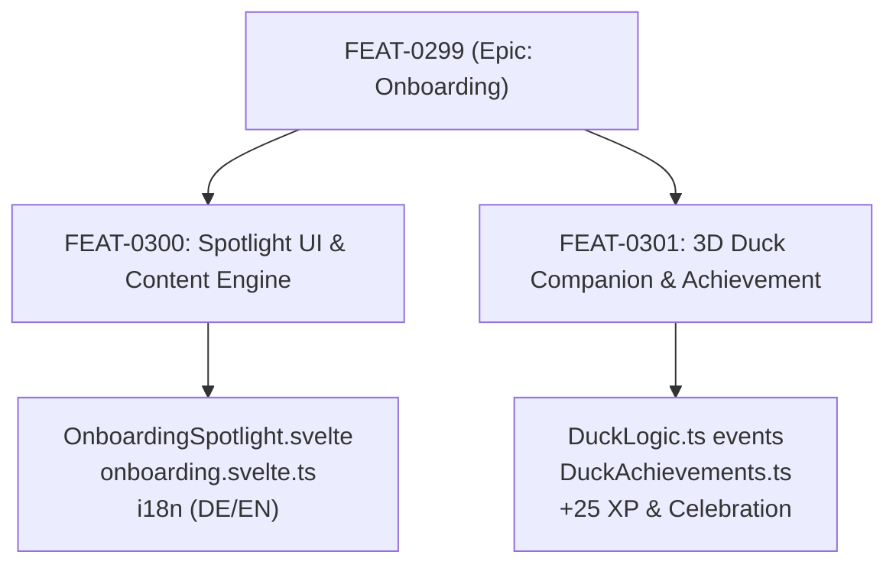

# FEAT-0299 — Epic: First-Time User Onboarding & Interactive Walkthrough

> **Tracking epic.** The work lives in two focused sub-items:
> [`FEAT-0300`](FEAT-0300-onboarding-spotlight-ui-and-content.md) (Spotlight Walkthrough UI, State Engine & Content) and
> [`FEAT-0301`](FEAT-0301-ducklogic-onboarding-companion-and-achievement.md) (Active 3D Duck Companion Integration & Achievement).
> This item holds shared requirements and acceptance criteria; it closes when both sub-items are `done`.

## Problem

New traders opening Cachy for the first time face a dense, high-capability trading workspace (position sizing inputs, multi-target TP/SL configurations, market overview widgets, exchange connections, and local-first storage). Without a quick, structured orientation, users can overlook key core safeguards (such as automatic lot-size calculation based on account risk) or feel overwhelmed by the interface density.

Currently, Cachy only provides a static Markdown guide modal and a Changelog. There is no interactive, step-by-step spotlight walkthrough that visually highlights key tools on the live screen while explaining Cachy's core workflow, risk safety, and privacy principles in under 60 seconds.

## Architecture & Sub-Items

| Item | Title | Scope | Area |
| :--- | :--- | :--- | :--- |
| [`FEAT-0300`](FEAT-0300-onboarding-spotlight-ui-and-content.md) | Spotlight Walkthrough UI, State Engine & Content | Overlay component, Svelte 5 store, 4 stations, DE/EN copy, Settings trigger | ui |
| [`FEAT-0301`](FEAT-0301-ducklogic-onboarding-companion-and-achievement.md) | Active 3D Duck Companion Integration & Achievement | Event-handling in `DuckLogic.ts`, `DuckAchievements.ts`, +25 XP reward, celebration animation | mascot |

## Acceptance criteria

- [ ] All acceptance criteria in [`FEAT-0300`](FEAT-0300-onboarding-spotlight-ui-and-content.md) are met.
- [ ] All acceptance criteria in [`FEAT-0301`](FEAT-0301-ducklogic-onboarding-companion-and-achievement.md) are met.
- [ ] Type checks (`npm run check`) and unit/component tests pass cleanly.

## Links

- [`FEAT-0300`](FEAT-0300-onboarding-spotlight-ui-and-content.md)
- [`FEAT-0301`](FEAT-0301-ducklogic-onboarding-companion-and-achievement.md)
- [`docs/adr/0001-local-first-boundary.md`](../../adr/0001-local-first-boundary.md)

## State

- Shipped in [PR #2218](https://github.com/mydcc/cachy-app/pull/2218) (squash commit 2ff4dabe on develop).
